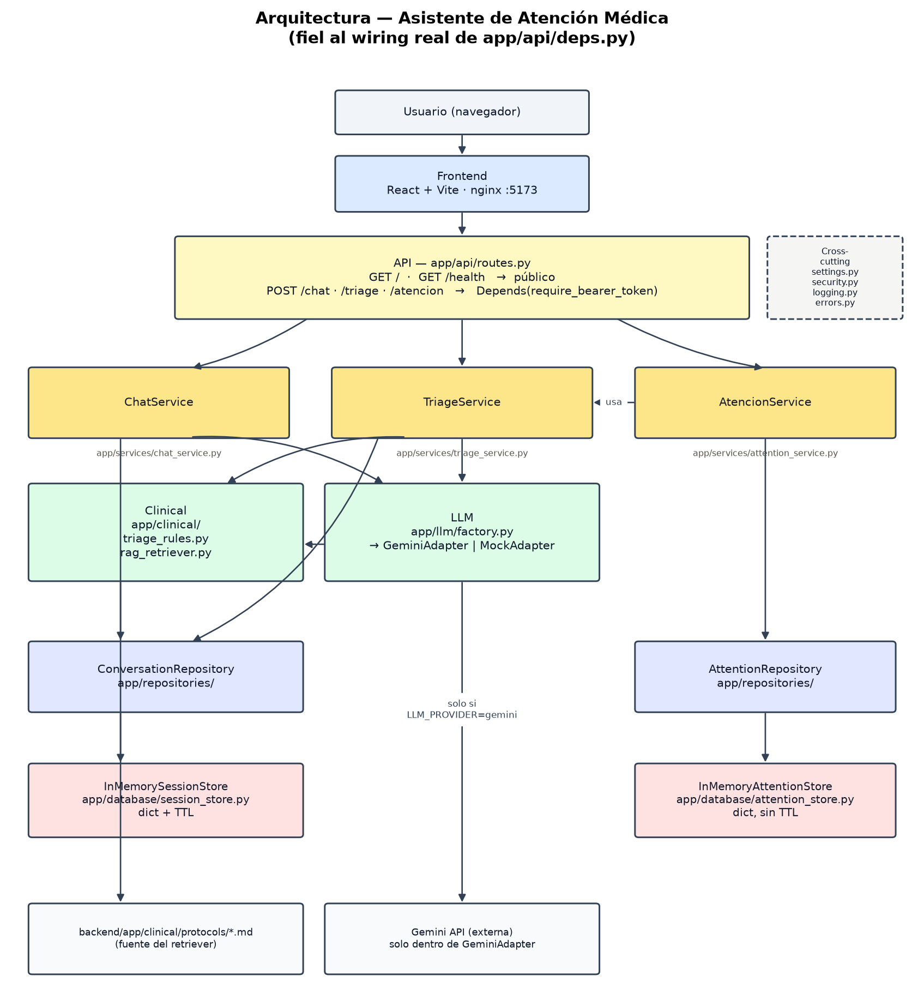

# Arquitectura del Backend

La arquitectura del asistente de atención médica está organizada en capas con el objetivo de separar las responsabilidades de presentación, lógica de negocio, conocimiento clínico y persistencia de datos. Esta separación permite que cada componente evolucione de forma independiente, facilita las pruebas unitarias y simplifica la incorporación de nuevos modelos de inteligencia artificial o mecanismos de almacenamiento.

El flujo general del sistema inicia cuando el usuario interactúa con la interfaz web, la cual envía las solicitudes a la API REST. La API actúa como punto de entrada del sistema y delega el procesamiento a los servicios de aplicación. Estos servicios implementan la lógica de negocio y utilizan tanto el motor clínico como el modelo de lenguaje para analizar la información suministrada por el paciente. Finalmente, los resultados son almacenados mediante los repositorios correspondientes.

---

# Flujo de la arquitectura

La interacción entre los componentes sigue el siguiente flujo:

1. El usuario envía una solicitud desde la interfaz web.
2. El frontend realiza una petición HTTP hacia la API.
3. La API valida la solicitud y autentica el acceso cuando es necesario.
4. El servicio correspondiente procesa la petición.
5. El servicio consulta el motor clínico y/o el modelo de lenguaje para obtener la información necesaria.
6. Los datos generados o consultados se almacenan mediante los repositorios.
7. Finalmente, la respuesta es devuelta al usuario.

---

# Componentes de la arquitectura

## Frontend

El frontend constituye la capa de presentación del sistema. Está desarrollado en React y es responsable de gestionar la interacción con el usuario, mostrando la conversación, enviando los mensajes a la API y presentando el resultado del triaje y de la atención médica.

---

## API

La API representa el punto de entrada del backend y expone los servicios REST del sistema.

Sus responsabilidades son:

- recibir las solicitudes del cliente;
- validar los datos de entrada;
- aplicar los mecanismos de autenticación;
- delegar el procesamiento a los servicios correspondientes.

La API no implementa reglas de negocio.

Los principales endpoints son:

| Endpoint | Responsabilidad |
|----------|-----------------|
| `POST /chat` | Gestionar la conversación con el paciente |
| `POST /triage` | Clasificar el nivel de triaje |
| `POST /attention` | Generar la atención médica |

---

## Servicios

Los servicios contienen la lógica de negocio del sistema y coordinan la interacción entre los diferentes componentes.

El sistema está compuesto por tres servicios principales:

### ChatService

Gestiona la conversación con el paciente, analiza los mensajes recibidos y determina las preguntas de seguimiento necesarias para completar la información clínica.

### TriageService

Analiza los síntomas identificados, consulta las reglas clínicas y el modelo de lenguaje para determinar el nivel de prioridad del paciente.

### AttentionService

Genera el documento final de atención médica utilizando el resultado del proceso de triaje.

---

## Motor clínico

El módulo **Clinical** implementa el conocimiento clínico del sistema mediante reglas deterministas y protocolos médicos.

Entre sus responsabilidades se encuentran:

- identificar banderas de alarma;
- consultar protocolos clínicos;
- clasificar casos mediante reglas médicas.

Este componente puede producir una clasificación clínica incluso sin utilizar un modelo de lenguaje.

---

## Modelo de lenguaje (LLM)

El módulo **LLM** proporciona las capacidades de procesamiento de lenguaje natural necesarias para mantener una conversación con el paciente.

Sus principales funciones son:

- interpretar las respuestas del usuario;
- extraer información clínica relevante;
- generar preguntas de seguimiento;
- elaborar resúmenes clínicos;
- apoyar el proceso de clasificación cuando es necesario.

La arquitectura desacopla esta funcionalidad mediante adaptadores, permitiendo utilizar diferentes proveedores de modelos sin modificar la lógica del sistema.

---

## Repositorios

Los repositorios encapsulan el acceso al almacenamiento de datos y desacoplan la lógica de negocio de la tecnología de persistencia utilizada.

El sistema distingue dos repositorios:

- **ConversationRepository**, encargado de administrar las conversaciones.
- **AttentionRepository**, encargado de almacenar las atenciones médicas generadas.

---

## Persistencia

La capa de persistencia administra el estado de las conversaciones y las atenciones médicas.

En la implementación actual se utilizan almacenes en memoria, lo que permite ejecutar el sistema sin depender de una base de datos externa durante la fase de desarrollo.

La arquitectura fue diseñada para reemplazar estos almacenes por una base de datos relacional sin modificar la lógica de negocio.

---

## Dependencias externas

El sistema interactúa con dos recursos externos:

- los protocolos clínicos almacenados localmente, utilizados durante el proceso de recuperación de información;
- la API de Gemini, empleada cuando el proveedor de lenguaje configurado corresponde a dicho servicio.

---

## Componentes transversales

Algunos módulos proporcionan funcionalidades comunes a toda la aplicación y son utilizados desde múltiples capas de la arquitectura.

Entre ellos se encuentran:

- configuración del sistema;
- autenticación y seguridad;
- registro de eventos (logging);
- manejo uniforme de excepciones.

---

## Consideraciones de diseño

Esta arquitectura fue diseñada siguiendo el principio de separación de responsabilidades (*Separation of Concerns*), donde cada capa tiene una función específica y una única responsabilidad. Gracias a este enfoque:

- La lógica de negocio permanece independiente de la interfaz de usuario.
- El conocimiento clínico está desacoplado del modelo de inteligencia artificial.
- Los mecanismos de persistencia pueden reemplazarse sin modificar los servicios.
- Es posible incorporar nuevos proveedores de modelos de lenguaje (LLM) sin afectar el resto de la aplicación.
- La aplicación es más fácil de mantener, probar y escalar.