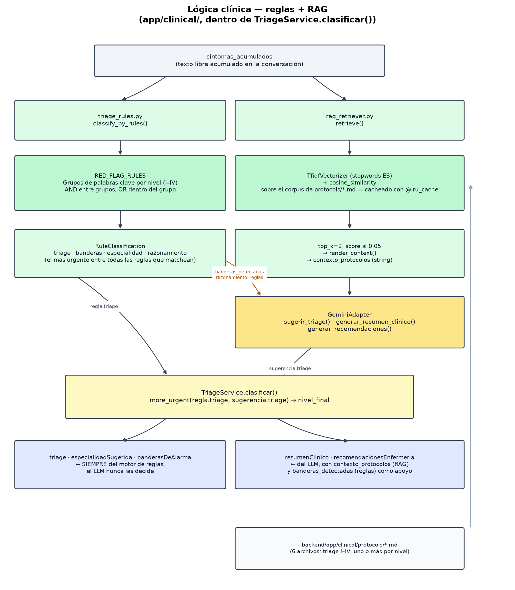

# Lógica clínica: reglas clínicas y recuperación de conocimiento (RAG)

El proceso de clasificación clínica combina dos mecanismos complementarios: un **motor de reglas clínicas**, encargado de aplicar criterios deterministas basados en protocolos médicos, y un mecanismo de **Recuperación Aumentada por Generación (Retrieval-Augmented Generation, RAG)**, cuyo objetivo es recuperar información clínica relevante para proporcionar contexto al modelo de lenguaje durante la generación de respuestas.

Mientras que las reglas clínicas garantizan la consistencia y seguridad en la clasificación del paciente, el componente RAG enriquece el razonamiento del modelo de lenguaje mediante protocolos médicos previamente definidos. La decisión final resulta de la combinación de ambos mecanismos.

---

# Flujo general

El proceso de clasificación sigue las siguientes etapas:

1. Se recopilan los síntomas identificados durante la conversación.
2. Los síntomas son procesados en paralelo por el motor de reglas clínicas y el módulo de recuperación de conocimiento (RAG).
3. El motor de reglas determina un nivel inicial de triaje y las banderas de alarma correspondientes.
4. El módulo RAG recupera los protocolos clínicos más relacionados con los síntomas detectados.
5. El modelo de lenguaje utiliza dicha información como contexto para generar un resumen clínico, recomendaciones y una sugerencia de clasificación.
6. Finalmente, el servicio de triaje fusiona ambas fuentes de información para obtener el resultado definitivo.

---

# Entrada del proceso

El punto de partida es el conjunto de síntomas recopilados durante la conversación con el paciente.

Esta información corresponde al texto acumulado generado durante el proceso conversacional y constituye la entrada común para los dos componentes principales del sistema:

- Motor de reglas clínicas.
- Módulo de recuperación de conocimiento (RAG).

Ambos componentes trabajan de forma independiente utilizando exactamente la misma información de entrada.

---

# Motor de reglas clínicas

El motor de reglas implementa el conocimiento clínico mediante reglas deterministas previamente definidas.

Su objetivo es identificar situaciones de riesgo utilizando combinaciones de signos y síntomas que representan criterios médicos establecidos.

Entre sus responsabilidades se encuentran:

- detectar banderas de alarma;
- clasificar el nivel de triaje;
- determinar la especialidad médica sugerida;
- generar una explicación de la clasificación realizada.

Este componente no utiliza modelos de inteligencia artificial y siempre produce el mismo resultado para una misma entrada.

---

# Recuperación de conocimiento (RAG)

El módulo RAG complementa el proceso de clasificación recuperando protocolos clínicos relacionados con los síntomas identificados.

Para ello realiza las siguientes tareas:

1. Consulta el repositorio de protocolos médicos.
2. Calcula la similitud entre la consulta del paciente y cada protocolo disponible.
3. Selecciona los documentos más relevantes.
4. Construye un contexto clínico que posteriormente será utilizado por el modelo de lenguaje.

El objetivo de este componente no es clasificar al paciente, sino proporcionar información adicional que permita generar respuestas más precisas y fundamentadas.

---

# Modelo de lenguaje

El modelo de lenguaje recibe como entrada:

- los síntomas del paciente;
- el contexto recuperado por el módulo RAG;
- las banderas de alarma y el razonamiento ya determinados por el motor de reglas.

Esto último es intencional: sin esa información, el modelo podía generar un resumen o una justificación que sonaran menos urgentes que el nivel que el sistema termina asignando igualmente por reglas. Al dársela como contexto, el texto generado queda alineado con la clasificación final.

Con esta información genera:

- un resumen clínico;
- recomendaciones para el personal asistencial;
- una sugerencia adicional de clasificación.

El modelo de lenguaje utilizado es un proveedor externo (Gemini); el sistema requiere su configuración para funcionar y no cuenta con una implementación simulada de respaldo.

---

# Fusión de resultados

El resultado final del proceso de triaje es obtenido por el servicio de clasificación, el cual combina la información proveniente del motor de reglas y del modelo de lenguaje.

La arquitectura prioriza siempre la seguridad clínica.

Por esta razón:

- el nivel de triaje nunca puede ser reducido por el modelo de lenguaje;
- las banderas de alarma siempre provienen del motor de reglas;
- la especialidad sugerida es determinada por las reglas clínicas;
- el resumen clínico y las recomendaciones son generados por el modelo de lenguaje.

Este enfoque permite aprovechar las capacidades de comprensión del lenguaje natural sin comprometer la consistencia de la clasificación clínica.

---

# Consideraciones de diseño

La separación entre reglas clínicas y modelo de lenguaje responde a una decisión arquitectónica orientada a mejorar la confiabilidad del sistema.

Las reglas clínicas representan conocimiento médico explícito y verificable, mientras que el modelo de lenguaje aporta capacidades de interpretación y generación de texto.

Gracias a esta separación:

- la clasificación clínica permanece controlada por reglas deterministas;
- el modelo de lenguaje puede reemplazarse sin modificar la lógica clínica;
- los protocolos médicos pueden actualizarse independientemente del modelo;
- el sistema mantiene un comportamiento consistente incluso cuando el proveedor del modelo de lenguaje cambia.

Esta arquitectura reduce la dependencia del modelo de inteligencia artificial para la toma de decisiones críticas y favorece un comportamiento más robusto y explicable del proceso de triaje.